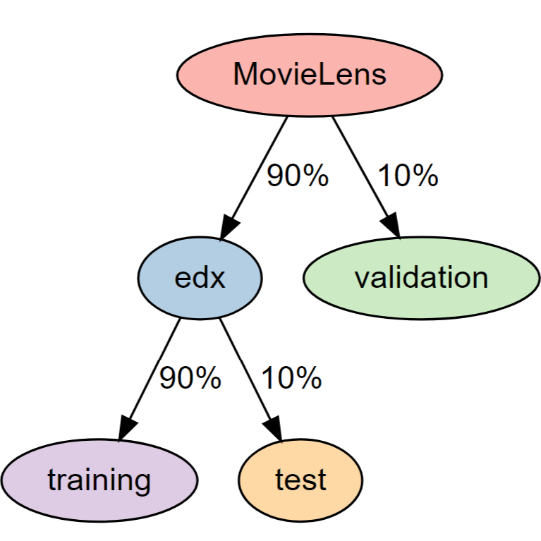
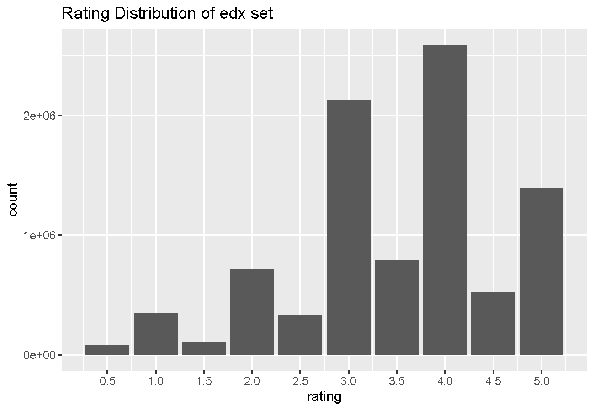
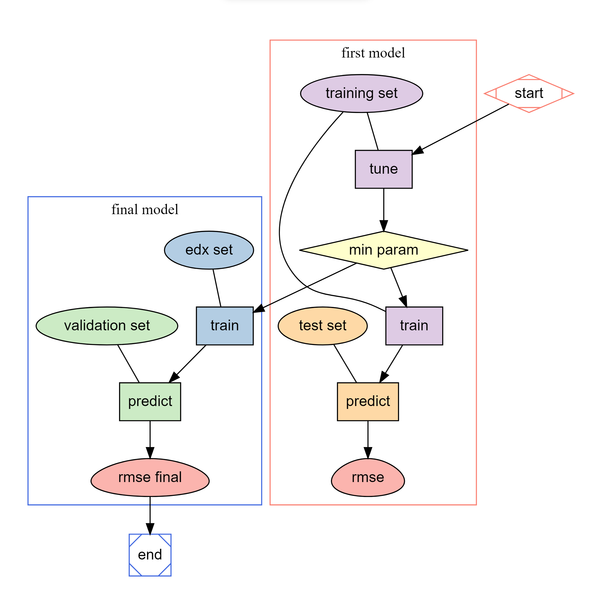
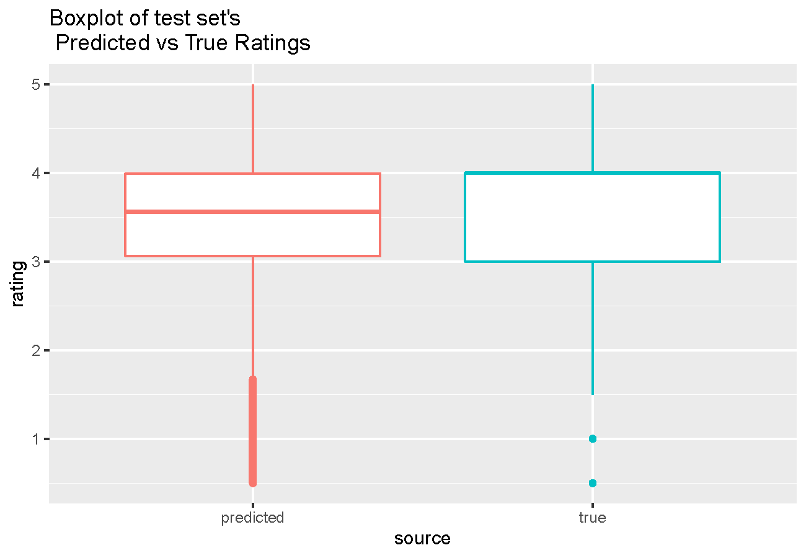

```{r setup, include=FALSE}
if (!require(knitr)) install.packages(
  "knitr", repos = "http://cran.us.r-project.org"
)

library(knitr)

options(digits = 3)

opts_chunk$set(
	echo = TRUE,
	message = FALSE,
	warning = FALSE,
	fig.align = "center",
	out.width = "75%"
)
```

```{r fonts, include=FALSE}
if (!require(gfonts)) install.packages(
  "gfonts", repos = "http://cran.us.r-project.org"
)
library(gfonts)

if (!dir.exists("fonts")) {
  dir.create("fonts")
}

download_font(
  id = "open-sans", output_dir = "fonts", 
  variants = c("regular", "italic", "bold")
)
download_font(
  id = "inconsolata", output_dir = "fonts", 
  variants = c("regular", "italic", "bold")
)
```

--------------------------------------------------------------------------------

Note: All the links are colored in \textcolor{violet}{violet} without underline,
feel free to click!

# Overview

## About this project

This machine learning project is about creating a movie recommendation system,
using the [MovieLens 10M](#ref-movielens) dataset. The goal is to develop a
machine learning algorithm that can predict movie ratings by users, with rmse
(root-mean-square-error) as low as possible.

Using [recosystem library](#ref-recosystem) which supports parallel matrix
factorization, my recommendation algorithm is able to predict ratings (from
unknown validation set) with a rmse of 0.786.

## Describe MovieLens dataset

Note: This section is just a brief overview. I'll go into more detail in the
[Methods](#methods) section.

From the [MovieLens readme](#ref-movielens) site, the MovieLens dataset contains
10000054 ratings of 10681 movies by 71567 users.

Each row of dataset contains:

-   `rating`: can be half/whole stars ranging from 0.5 to 5
-   `userId`: represent a user, unique
-   `movieId`: represent a movie, unique
-   `title`: title of the movie, with year in parenthesis
-   `genres`: genres of the movie in a pipe-separated list, selected from a
    total of [18 genres](#appx-movie-genres)
-   `timestamp`: time when the user rated the movie

```{r diagram-dataset, echo=FALSE, out.width="30%"}

```

Immediately after downloading the MovieLens dataset, data is split into edx
(90%) and validation (10%) sets.

-   edx set is used in model development
-   validation set is NOT used anywhere except when **testing the final model**,
    so it's hidden data

Just to give a preview of data visualization in this overview section, here is a
histogram that shows the ratings distribution of edx set. We can see that whole
star ratings are more common than half star ratings.

```{r plot-edx, echo=FALSE}

```

## Key steps performed {#key-steps}

```{r diagram-steps, echo=FALSE, out.width="50%"}

```

1.  download and split MovieLens dataset into edx and validation sets

2.  explore and visualize edx set

3.  develop the **first** model

-   split edx set into training and test sets

-   using training set

    -   **tune** to find the best tuning opts that achieve min. rmse
    -   **train** with best tuning opts

-   using test set

    -   **predict** ratings
    -   **evaluate** rmse

> See [Modeling approach section](#modeling-approach) for more explanation.
>
> In recosystem, a model has 2 parts: best tuning opts and training data. Final
> model differs with first model by **using edx instead of training set**,
> because it has the full data.
>
> First model: training set + best tuning opts
>
> Final model: edx set + best tuning opts

4.  develop the **final** model

-   using edx set

    -   **train** the final model with best tuning opts

-   using validation set

    -   **predict** ratings
    -   **evaluate** rmse

# Methods {#methods}

## Step 1: Prepare dataset

First, let's download and split MovieLens dataset into edx and validation sets.
We will download the libraries that are required to split dataset, as well as
recosystem library used in the recommendation algorithm. By using different
joins, there won't be any user/movie in `validation` that's not in `edx`.

Note: This download code is provided by the course.

```{r step1-download, results='hide', cache=TRUE}
if (!require(tidyverse)) install.packages(
  "tidyverse", repos = "http://cran.us.r-project.org"
)
if (!require(caret)) install.packages(
  "caret", repos = "http://cran.us.r-project.org"
)
if (!require(data.table)) install.packages(
  "data.table", repos = "http://cran.us.r-project.org"
)
if (!require(recosystem)) install.packages(
  "recosystem", repos = "http://cran.us.r-project.org"
)

library(tidyverse)
library(caret)
library(data.table)
library(recosystem)

dl <- tempfile()
download.file("http://files.grouplens.org/datasets/movielens/ml-10m.zip", dl)

ratings <- fread(
  text = gsub(
    "::", "\t",
    readLines(unzip(dl, "ml-10M100K/ratings.dat"))
  ),
  col.names = c("userId", "movieId", "rating", "timestamp")
)

movies <- str_split_fixed(
  readLines(unzip(dl, "ml-10M100K/movies.dat")),
  "\\::", 3
)
colnames(movies) <- c("movieId", "title", "genres")

# if using R 3.6 or earlier:
if (as.integer(R.version$major) <= 3 & as.double(R.version$minor) <= 6) {
  movies <- as.data.frame(movies) %>%
    mutate(
      movieId = as.numeric(levels(movieId))[movieId],
      title = as.character(title),
      genres = as.character(genres)
    )
}

# if using R 4.0 or later:
if (as.integer(R.version$major) >= 4) {
  movies <- as.data.frame(movies) %>%
    mutate(
      movieId = as.numeric(movieId),
      title = as.character(title),
      genres = as.character(genres)
    )
}

movielens <- left_join(ratings, movies, by = "movieId")

# if using R 3.5 or earlier, use `set.seed(1)`
if (as.integer(R.version$major) <= 3 & as.double(R.version$minor) <= 5) {
  set.seed(1)
} else {
  set.seed(1, sample.kind = "Rounding")
}

test_index <- createDataPartition(
  y = movielens$rating, times = 1, p = 0.1, list = FALSE
)
edx <- movielens[-test_index, ]
temp <- movielens[test_index, ]

# Make sure userId and movieId in validation set are also in edx set
validation <- temp %>%
  semi_join(edx, by = "movieId") %>%
  semi_join(edx, by = "userId")

# Add rows removed from validation set back into edx set
removed <- anti_join(temp, validation)
edx <- rbind(edx, removed)

rm(dl, ratings, movies, test_index, temp, movielens, removed)
```

Because I will only use `userId`, `movieId`, `rating` columns, we keep these 3
columns and remove the rest. Lastly, we save `edx` and `validation` dataframes
into rda files, and remove `validation` to save memory. The validation set rda
file can be loaded back in future when we use it.

```{r step1-prepare, results='hide'}
edx <- edx %>% select(userId, movieId, rating)
validation <- validation %>% select(userId, movieId, rating)

if (!dir.exists("rdas")) {
  dir.create("rdas")
}
save(edx, file = "rdas/edx.rda")
save(validation, file = "rdas/validation.rda")

rm(validation)
```

Let's view `edx` by sampling a few rows.

```{r step1-edx-head}
set.seed(1)
edx %>% slice_sample(n = 6)
```

## Step 2: Describe dataset

### edx rating {#edx-rating}

Let's see the 5-number summary (min, Q1, median, Q3, max) of `edx$rating`.

```{r step2-rating-summary}
summary(edx$rating)
```

We can see that the minimum rating is 0.5, and half of the ratings are between 3
and 4 stars, so overall users are kind in their ratings!

Here is a ratings histogram, which shows that whole star ratings are more common
than half star ratings.

```{r step2-rating-histogram, echo=FALSE}
edx %>%
  ggplot(aes(rating)) +
  geom_bar() +
  scale_x_continuous(breaks = seq(0.5, 5, 0.5)) +
  labs(title = "Rating Distribution of edx set")
```

### Users and movies

There are 69878 users and 10677 movies are in `edx` set, and the sparsity is
1.21%.

```{r step2-sparsity}
n_distinct(edx$userId)
n_distinct(edx$movieId)
nrow(edx) / (n_distinct(edx$userId) * n_distinct(edx$movieId))
```

## Step 3: Develop the first model

### Create training and test sets

We can split `edx` set into `train` set (90%) and `test` set (10%) using the
caret package. By using different joins, there won't be any user/movie in `test`
that's not in `train`.

```{r step3-split, results='hide'}
set.seed(1)
test_index <- createDataPartition(
  y = edx$rating, times = 1, p = 0.1, list = FALSE
)
train <- edx[-test_index, ]
temp <- edx[test_index, ]

# Make sure userId and movieId in test set are also in training set
test <- temp %>%
  semi_join(train, by = "movieId") %>%
  semi_join(train, by = "userId")

# Add rows removed from test set back into training set
removed <- anti_join(temp, test)
train <- rbind(train, removed)

rm(edx, test_index, temp, removed)
```

### Modeling approach {#modeling-approach}

#### What is a model?

To create a model means developing an algorithm by analyzing a known dataset.
Machine learning is about using this model so that it can predict useful
information of a new/unknown dataset.

#### Tune: generate the best recosystem algorithm

Previously in [Key Steps](#key-steps) we described that a model in recosystem
has 2 parts: training data + best tuning opts. Training data is the known
dataset, and best tuning opts is the algorithm part.

Although we don't know how recosystem does matrix factorization under the hood,
we can **create different recosystem algorithms by putting in different tuning
parameters**. This process is the tuning step, and the goal is to find best
tuning opts: the optimal param and option values that result in min rmse, and
thus generate the **best recosystem algorithm** *for our data*.

> The emphasis is on "for our data" because different tuning opts work best for
> different data. What we consider the best recosystem algorithm for movie
> recommendation is unlikely to work for song recommendation.

#### Train: create the model

Once we are satisfied with the rmse resulted by best tuning opts, we execute the
algorithm on training data to create a model. The model will contain matrices
necessary for the predicting step.

#### Predict: use the model to predict the unknown

The predict step uses the matrices in the model to predict ratings in the
unknown set. After getting the predicted ratings list, we can calculate the rmse
by comparing with the list of true ratings.

#### recosystem functions

Tune, train, and predict functions are stored in the model object, using and
updating information in the model. Each step is further explained in the next
sections.

|                    |                   |
|--------------------|-------------------|
| create a new model | `model <- Reco()` |
| tune               | `model$tune()`    |
| train              | `model$train()`   |
| predict            | `model$predict()` |

### Create the first model {#create-the-first-model}

Using `Reco()` function, we create a new model object.

```{r step3-create-model}
first_model <- Reco()
```

But we are not yet done the setup because there is a data conversion step.

To put our data `train` and `test` in recosystem, they need to be **converted
from dataframes to DataSource** objects. We can use `data_memory` function to
convert. The DataSource objects will contain same data as the original
dataframes.

Let's add the **`_data`** suffix to DataSource variable names to avoid mix up.
Here's a table that shows the variable names, and the syntax to access user,
movie, and rating columns.

| Name         | Type       | Access user  | Access movie | Access rating |
|--------------|------------|--------------|--------------|---------------|
| `train`      | dataframe  | `$userId`    | `$movieId`   | `$rating`     |
| `train_data` | DataSource | `@source[1]` | `@source[2]` | `@source[3]`  |
| `test`       | dataframe  | `$userId`    | `$movieId`   | `$rating`     |
| `test_data`  | DataSource | `@source[1]` | `@source[2]` | `@source[3]`  |

Note: The `index1` argument below in `data_memory` function asks whether the ids
start with 0 or 1. They start with 1, so we set `index1 = TRUE`.

```{r step3-index1}
min(train$userId)
min(train$movieId)
```

```{r step3-convert-data}
train_data <- data_memory(
  user_index = train$userId,
  item_index = train$movieId,
  rating = train$rating,
  index1 = TRUE
)

test_data <- data_memory(
  user_index = test$userId,
  item_index = test$movieId,
  rating = test$rating,
  index1 = TRUE
)

rm(train, test)
```

### Tuning

The `$tune()` function uses k-fold cross validation to tune the model's
parameters.

**input**

-   `train_data`: training data

-   `opts`: parameters and options

    -   params are tuned, tune will choose the best value for each param

    -   options are NOT tuned, think of these as settings

**output**

-   `min` (**best tuning opts** mentioned earlier): the optimal combination with
    each param assigned a value, that result in **minimum rmse**
-   `res`: each combination and its rmse

#### Default tuning opts {#default-tuning-opts}

From the help file by typing `?tune` in console, we find recosystem default
tuning opts. Default is used when calling `model$tune()` with no `opts`
argument. The code chunk below shows what default looks like, and stores the
tuning opts in a variable.

The tune function will look through each combination and pick the best one with
min rmse, out of $2^6 = 64$ combinations (6 params, 2 choices each).

> For example, the first combination is:
> `dim = 10, costp_l1 = 0, costp_l2 = 0.01, costq_l1 = 0, costq_l2 = 0.01, lrate = 0.01`.

```{r step3-default}
best_tune_opts <- list(
  # params
  dim = c(10, 20),
  costp_l1 = c(0, 0.1),
  costp_l2 = c(0.01, 0.1),
  costq_l1 = c(0, 0.1),
  costq_l2 = c(0.01, 0.1),
  lrate = c(0.01, 0.1),
  # options
  loss = "l2",
  nfold = 5,
  niter = 20,
  nthread = 1,
  nbin = 20,
  nmf = FALSE,
  verbose = FALSE,
  progress = TRUE
)
```

Here's a table about what each parameter and option means.

> P in `costp` means user, Q in `costq` means movies in this case.
>
> l2 is related to RMSE - the squared error, l1 is related to MAE - mean
> absolute error.

+-----------------+-----------------+-----------------+---------------------+
| Parameters      | What it is      | Options         | What it is          |
+=================+=================+=================+=====================+
| dim             | number of       | nfold           | number of folds in  |
|                 | factors for     |                 | cross validation    |
|                 | matrix          |                 |                     |
|                 | factorization   |                 |                     |
+-----------------+-----------------+-----------------+---------------------+
| costp_l1        | L1 user factors | niter           | number of           |
|                 | regularization  |                 | iterations          |
|                 | cost            |                 |                     |
+-----------------+-----------------+-----------------+---------------------+
| costp_l2        | L2 user factors | nthread         | number of threads   |
|                 | regularization  |                 | for parallel        |
|                 | cost            |                 | computing           |
+-----------------+-----------------+-----------------+---------------------+
| costq_l1        | L1 movie        | nbin            | number of bins:     |
|                 | factors         |                 | must be $>$ nthread |
|                 | regularization  |                 |                     |
|                 | cost            |                 |                     |
+-----------------+-----------------+-----------------+---------------------+
| costq_l2        | L2 movie        | nmf             | whether to perform  |
|                 | factors         |                 | non-negative matrix |
|                 | regularization  |                 | factorization       |
|                 | cost            |                 |                     |
+-----------------+-----------------+-----------------+---------------------+
| lrate           | learning rate:  | verbose         | whether to print    |
|                 | step size in    |                 | info in console     |
|                 | gradient        |                 |                     |
|                 | descent         |                 |                     |
+-----------------+-----------------+-----------------+---------------------+
| loss            | error function: | progress        | whether to print    |
|                 | loss = l2 for   |                 | progress bar in     |
|                 | rmse            |                 | console             |
+-----------------+-----------------+-----------------+---------------------+

#### Change the default opts

The default provides a nice starting point, but we want to customize the params
and options before we call tune function for the first time. Yes, we will call
tune function 2 times! The reasons are below each code chunk.

```{r step3-change-options}
best_tune_opts$nthread <- 16
best_tune_opts$nbin <- 128
best_tune_opts$nmf <- TRUE
best_tune_opts$verbose <- TRUE
```

**Options**

+---------------+---------------+---------------+------------------------------+
| Option        | Old value     | New value     | Reason for change            |
+===============+===============+===============+==============================+
| nthread       | 1             | 16            | Take advantage of            |
|               |               |               | recosystem's parallel        |
|               |               |               | computation and speed up the |
|               |               |               | process.                     |
+---------------+---------------+---------------+------------------------------+
| nbin          | 20            | 128           | What nbin exactly means is   |
|               |               |               | unclear in recosystem's help |
|               |               |               | file, but since nbin must be |
|               |               |               | $>$ nthread, I just made     |
|               |               |               | them both bigger.            |
+---------------+---------------+---------------+------------------------------+
| nmf           | FALSE         | TRUE          | All our ratings are          |
|               |               |               | non-negative, we don't want  |
|               |               |               | any predicted ratings to be  |
|               |               |               | $<$ 0.                       |
+---------------+---------------+---------------+------------------------------+
| verbose       | FALSE         | TRUE          | Outputs progress in RStudio  |
|               |               |               | console (not in report pdf,  |
|               |               |               | there would be many pages!)  |
+---------------+---------------+---------------+------------------------------+

**Params**

The 2 tuning performance concerns are efficiency and quality.

Tuning needs to be efficient because its intense computation can take a long
time, so we want to **run as few combinations as possible**. The changed set
only has $2^4 = 16$ combinations compared to the default of [64
combinations](#default-tuning-opts). We choose to only test 2 values for each
param (picking 3 values would result in $3^4 = 81$ combinations). We should also
try to improve the quality of each tuning, so we **shouldn't waste on
unlikely/bad guesses** with only 2 values to test for each param.

Moreover, the goal of tuning is try to find/approach the global minimum of rmse
in a few rounds of tuning, but it's easy to get stuck inside a local minimum. We
can avoid this by starting out big **(test values that are farther apart) in the
first call** of tuning, then we narrow down, test the best value's close
neighbors in later rounds. More on this later!

> For example, the first combination is:
> `dim = 20, lrate = 0.1, costp_l1 = 0, costp_l2 = 0, costq_l2 = 0, costq_l2 = 0`

```{r step3-change-params}
best_tune_opts$dim <- c(20, 40)
best_tune_opts$lrate <- c(0.1, 0.2)
best_tune_opts$costp_l1 <- 0
best_tune_opts$costp_l2 <- c(0, 0.2)
best_tune_opts$costq_l1 <- 0
best_tune_opts$costq_l2 <- c(0, 0.2)
best_tune_opts
```

+---------------+---------------+---------------+------------------------------+
| Param         | Old value     | New value     | Reason for change            |
+===============+===============+===============+==============================+
| dim           | c(10, 20)     | c(20, 40)     | I believe that the more      |
|               |               |               | dimensions in matrix         |
|               |               |               | factorization, the better    |
|               |               |               | the result would be. Since   |
|               |               |               | movies have [18 movie        |
|               |               |               | genres](#appx-movie-genres), |
|               |               |               | my guess is that we need at  |
|               |               |               | least 20 dimensions.         |
+---------------+---------------+---------------+------------------------------+
| lrate         | c(0.01, 0.1)  | c(0.1, 0.2)   | A learning rate step size of |
|               |               |               | 0.01 is not a good guess     |
|               |               |               | because it's almost 0 (no    |
|               |               |               | gradient descent), test 0.2  |
|               |               |               | instead                      |
+---------------+---------------+---------------+------------------------------+
| costp_l1,     | c(0, 0.1)     | 0             | l1 is related to mean        |
| costq_l1      |               |               | absolute error, not rmse, so |
|               |               |               | won't tune these             |
+---------------+---------------+---------------+------------------------------+
| costp_l2      | c(0.01, 0.1)  | c(0, 0.2)     | l2 is related to rmse, and   |
|               |               |               | we test a bigger range       |
+---------------+---------------+---------------+------------------------------+

#### Tuning round 1

Now let's tune, and store the tune result in a variable.

```{r step3-tune1, results='hide'}
set.seed(1)
tune_output <- first_model$tune(train_data, opts = best_tune_opts)
```

`min` shows the combination that yields the minimum rmse, and `res` shows rmse
of all combinations. The minimum rmse is 0.801, so looks pretty good on the
first try!

```{r step3-tune1-output}
tune_output$min
tune_output$res
```

##### Analysis

We can visualize the full result better with 2 raster plots.

**dim-lrate plot**: Using tidyverse library, we can `group by` dim and lrate (4
combinations), but because there are 4 rmses for each combination (since l2
factors are not fixed), we take the minimum rmse in `summarize`. The code chunk
below shows the dataframe which can then be piped to ggplot.

**l2 factors plot**: similar to first plot, `group by` costp_l2 and costq_l2,
and `summarize` min rmse

```{r step3-tune1-group}
tune_output$res %>%
  group_by(dim = factor(dim), lrate = factor(lrate)) %>%
  summarize(rmse = min(loss_fun))

tune_output$res %>%
  group_by(costp_l2 = factor(costp_l2), costq_l2 = factor(costq_l2)) %>%
  summarize(rmse = min(loss_fun))
```

```{r step3-tune1-dim-lrate-raster, echo=FALSE}
tune_output$res %>%
  group_by(dim = factor(dim), lrate = factor(lrate)) %>%
  summarize(rmse = min(loss_fun)) %>%
  ggplot(aes(dim, lrate, fill = rmse)) +
  geom_raster() +
  labs(
    fill = "Min. rmse",
    title = "Raster Plot of rmse with dim and lrate"
  ) +
  scale_fill_distiller(palette = "Reds")
```

Looking at the color bar legend in the dim-lrate raster plot, rmses roughly
ranges from 0.802 to 0.81, and don't vary much from each other. This suggests
that we further tuning dim and lrate won't be much of an improvement.

```{r step3-tune1-l2-raster, echo=FALSE}
tune_output$res %>%
  group_by(costp_l2 = factor(costp_l2), costq_l2 = factor(costq_l2)) %>%
  summarize(rmse = min(loss_fun)) %>%
  ggplot(aes(costp_l2, costq_l2, fill = rmse)) +
  geom_raster() +
  labs(
    fill = "Min. rmse",
    title = "Raster Plot of rmse with l2 Cost Factors"
  ) +
  scale_fill_distiller(palette = "Blues")
```

However, the color bar legend in the l2 cost factors plot shows that rmses
roughly ranges from 0.8 to 0.88, which is a big difference. Notably it's
`costq_l2` that significantly changes the rmses. Looking at the 2 tiles in the
first column `costp_l1 = 0`, changing `costq_l2` from 0 to 0.2 reduces rmse by
about 0.03. We will further tune `costq_l2` (the movie regularization cost
factors) in the next round.

Before starting tuning round 2, let's make sure our tuning list variable is
synced up with this round's min result.

```{r step3-tune1-update}
best_tune_opts$dim <- tune_output$min$dim
best_tune_opts$lrate <- tune_output$min$lrate
best_tune_opts$costp_l2 <- tune_output$min$costp_l2
best_tune_opts$costq_l2 <- tune_output$min$costq_l2
```

#### Tuning round 2

In tuning round 1's analysis section, we chose to further tune `costq_l2`, the
movie cost factors. We can verify whether `costq_l2 = 0.2` result in the true
minimum of rmse, or if there is a better neighbor of 0.2 that results in an even
lower rmse.

We choose the neighborhood of $[0.05, 0.3]$ with a step size of 0.05. The
expanded list is 0.05, 0.1, 0.15, 0.2, 0.25, 0.3. This time we can afford to
test 6 values, because we are only tuning 1 param, so there are only 6
combinations! The code chunk below updates `costq_l2` and displays our tuning
list variable.

```{r step3-tune2-param}
best_tune_opts$costq_l2 <- seq(0.05, 0.3, 0.05)
```

Now let's tune, and see the result!

```{r step3-tune2, results='hide'}
set.seed(1)
tune_output <- first_model$tune(train_data, opts = best_tune_opts)
```

```{r step3-tune2-output}
tune_output$min
```

##### Analysis

The min rmse is 0.797, with `costq_l2 = 0.1`. We can plot the full result using
`geom_point`.

```{r step3-tune2-plot, echo=FALSE}
tune_output$res %>%
  ggplot(aes(costq_l2, loss_fun)) +
  geom_point() +
  scale_x_continuous(breaks = best_tune_opts$costq_l2) +
  labs(
    y = "rmse",
    title = "Plot of RMSE vs. Movie l2 Cost Factors"
  )
```

We won't tune costq_l2 again, because there isn't much room for improvement.
Here the lowest rmse is only 0.01 lower than highest rmse. Update and print the
best tuning opts variable, and the tuning stage is now complete!

```{r step3-tune2-update}
best_tune_opts$costq_l2 <- tune_output$min$costq_l2
best_tune_opts

rm(tune_output)
```

### Train

The `$train()` function will read from training data, and create a model that
contains matrices necessary for prediction later. We'll be using `train_data` as
our training data.

**input**

-   `train_data`: training data

-   `out_model`: where the model is stored, set `NULL` for storing in memory

-   `opts`: tuning params and options

**output**

-   There is no return value, but `$model` will be populated.

The code chunk output below shows that `tr_rmse` (training rmse) gradually
decreases over `niter = 20` training iterations.

```{r step3-train}
set.seed(1)
first_model$train(train_data, opts = best_tune_opts)
```

#### Analysis

How does the model generates and improves this `tr_rmse`, and why this rmse is
so much better than the 0.797 we got in tuning? The model probably uses cross
validation and gradient descent, though we don't really know what recosystem
does in its source code.

If the more iterations we train, the lower the `tr_rmse`, why not try a lot more
iterations like 100 iterations? However, this is NOT a good idea because **we
don't want to over-train** the model with training data, because eventually the
model will be evaluated against the unknown test data.

### Predict

The `$predict()` function predicts unknown ratings in the testing data. We'll be
using `test_data` as our testing data.

**input**

-   `test_data`: testing data

-   `out_pred`: where to store the predicted ratings, set `out_memory()` to
    store in memory

output

-   a list of predicted ratings

> Note: The true ratings stored in `test_data` will be ignored by the predict
> function. Only user and movie ids are used. From help file by typing
> `?predict`:
>
> In `$predict()` ... the testing data have the same format as training data,
> except that the value (rating) column is not required, and **will be ignored
> if it is provided**.

Let's predict the ratings and see the 5-number summary.

```{r step3-predict}
set.seed(1)
pred_ratings <- first_model$predict(test_data, out_memory())

summary(pred_ratings)
```

The predicted ratings range falls outside of the star range $[0.5, 5]$. Plotting
a histogram, we can see that it's a left-skewed bell curve. Unlike edx set
distribution we've seen in the [data exploration](#edx-rating) section, where
there are a lot more whole star ratings, here our predicted ratings **don't
favor whole stars ratings over half stars**.

```{r step3-predict-histogram, echo=FALSE}
tibble(rating = pred_ratings) %>%
  ggplot(aes(rating)) +
  geom_histogram(binwidth = 0.5) +
  scale_x_continuous(breaks = seq(0, 6.5, 0.5)) +
  labs(title = "Distribution of test set's Predicted Ratings")
```

Using the `bound_rating()` function, we can bound the predicted ratings inside
the $[0.5, 5]$ by setting any rating $<$ 0.5 to 0.5, and any rating $>$ 5 to 5.
As we've seen in the [data conversion](#create-the-first-model) section, test
set's true ratings are stored as `test_data@source[[3]]`. We call
`evaluate_rmse()` with true and predicted ratings. The evaluated rmse is 0.789.

```{r step3-rmse}
bound_rating <- function(ratings) {
  sapply(ratings, function(r) {
    if (r > 5) return(5)
    if (r < 0.5) return(0.5)
    return(r)
  })
}

evaluate_rmse <- function(true, pred) {
  sqrt(
    mean((true - pred)^2)
  )
}

pred_ratings <- bound_rating(pred_ratings)

rmse_test <- evaluate_rmse(test_data@source[[3]], pred_ratings)
rmse_test
```

#### Analysis

Besides rmse evaluation, there is much more information for us to discover. For
instance, we can generate a boxplot comparing the predicted and true ratings.
The model predicted ratings with nearly the same IQR (interquartile range/middle
half) as the true ratings. **However, the model is a little cautious on
predicting higher ratings.** The predicted median about 3.5 is lower than the
true median of 4.

```{r step3-predict-boxplot, echo=FALSE, out.width="50%"}
rbind(
  tibble(rating = pred_ratings, source = "predicted"),
  tibble(rating = test_data@source[[3]], source = "true")
) %>%
  ggplot(aes(source, rating, color = source)) +
  geom_boxplot() +
  guides(color = "none") +
  labs(title = "Boxplot of test set's \n Predicted vs True Ratings")
```

We can use a jitter point plot to see for each true star rating how far off our
predicted ratings are.

> The plot is generated by sampling 5000 points (for the code to finish on
> time). The alpha is 0.005, so if readers see one solid colored dot, it's the
> result of an overlap of hundreds of points.

```{r step3-predict-jitterplot, echo=FALSE}
set.seed(1)
tibble(true = test_data@source[[3]], pred = pred_ratings) %>%
  slice_sample(n = 5000) %>%
  ggplot(aes(true, pred, color = factor(true))) +
  geom_point(alpha = 0.005) +
  geom_jitter() +
  scale_x_continuous(breaks = seq(0.5, 5, 0.5)) +
  scale_y_continuous(breaks = seq(0.5, 5, 0.5)) +
  guides(color = "none") +
  labs(x = "true", y = "predicted",
       title = "test set's Predicted vs True Ratings")
```

Predicted ratings are continuous, but true ratings are whole/half stars. Could
we then round the continuous ratings to star ratings? Similar to the standard
decimal rounding rules, $<$ 0.25 rounds to 0, $[0.25, 0.74)$ rounds to 0.5, and
$>$ 0.75 rounds to 1.

If we choose to round ratings to whole/half stars, then:

-   Rounding one predicted rating **farther** from the true rating contributes
    to a **larger error** compared with no rounding. For example, true rating =
    3.5, predicted rating = 3.2, rounded rating = 3

-   Rounding one predicted rating **closer** to the true rating contributes to a
    **smaller error** compared with no rounding. For example, true rating = 4,
    predicted rating = 3.8, rounded rating = 4

Since **rmse penalizes larger errors much more than smaller errors**, making 1
bad rounding of large error might need many good rounding of small error.
Rounding is beneficial when many points are concentrated close around true
rating, and only few points are far away. We are NOT seeing this shape in our
jitter plot since many points are far away, so we won't round.

Finally we clean up the variables and prepare for step 4, the final model.

```{r step3-cleanup}
rm(train_data, test_data, pred_ratings, first_model, rmse_test)
```

## Step 4: Develop the final model

Finally we reached to the most exciting step, combining previous tuning list
with edx set and form the final model! I won't put much description here since
the steps are almost the same as when we created the first model.

### Create final model

We convert `edx` and `validation` dataframes to recosystem DataSource objects
`edx_data` and `validation_data`. We create a new model object named
`final_model`.

```{r step4-create-model}
load("rdas/edx.rda")
load("rdas/validation.rda")

edx_data <- data_memory(
  user_index = edx$userId,
  item_index = edx$movieId,
  rating = edx$rating,
  index1 = TRUE
)

validation_data <- data_memory(
  user_index = validation$userId,
  item_index = validation$movieId,
  rating = validation$rating,
  index1 = TRUE
)

rm(edx, validation)

final_model <- Reco()
```

### Train

We skip the tuning stage for the final model, because we are satisfied with our
first model tuning opts, which forms the algorithm. We are using the same
algorithm, but on the full edx set data.

The training stage generates the matrices necessary for the predicting stage.

```{r step4-train}
set.seed(1)
final_model$train(edx_data, opts = best_tune_opts)
```

### Predict

The predicting stage only takes the user and movie ids (ignoring ratings
argument) of validation set and outputs predicted ratings. We can see the
5-number summary, and the histogram of our predicted ratings.

```{r step4-predict}
set.seed(1)
pred_ratings <- final_model$predict(validation_data, out_memory())

summary(pred_ratings)
```

```{r step4-predict-histogram, echo=FALSE}
tibble(rating = pred_ratings) %>%
  ggplot(aes(rating)) +
  geom_histogram(binwidth = 0.5) +
  scale_x_continuous(breaks = seq(0, 6.5, 0.5)) +
  labs(title = "Distribution of validation set's Predicted Ratings")
```

Since we know that ratings are in the range $[0.5, 5]$, any rating that falls
outside this range can be bounded inside: set ratings $<$ 0.5 to 0.5, and
ratings $>$ 5 to 5.

```{r step4-bound-ratings}
pred_ratings <- bound_rating(pred_ratings)
```

# Results

## rmse

Let's evaluate the rmse for the validation set - final hold out test set. The
rmse is 0.786.

```{r result-rmse}
rmse_validation <- evaluate_rmse(
  validation_data@source[[3]], pred_ratings
)
rmse_validation
```

Overall, the final model performs really well, as expected. As we learned in the
[Modeling approach](#modeling-approach) section, getting the best tuning opts is
like getting the best recosystem algorithm. In the first model, we generated
best algorithm using training set, and got a rmse of 0.789 when tested on test
set. Using the same algorithm on the final model, we got a rmse of 0.786 on
validation set, almost the same rmse as before. This best tuning opts / our
algorithm is robust.

## Plots

We can generate a boxplot that compares predicted vs true ratings of validation
set. We can also pull up test set's boxplot generated in step 3 for comparison.
The shapes look exactly the same due to using the same algorithm, but we can
distinguish the plots by looking at the titles.

```{r result-boxplot, echo=FALSE, out.width="50%"}
rbind(
  tibble(rating = pred_ratings, source = "predicted"),
  tibble(rating = validation_data@source[[3]], source = "true")
) %>%
  ggplot(aes(source, rating, color = source)) +
  geom_boxplot() +
  guides(color = "none") +
  labs(title = "Boxplot of validation set's \n Predicted vs True Ratings")


```

We can further explore the relationship of predicted vs true ratings by
generating a violin plot using `geom_violin`. A violin plot is combining a
boxplot and a density plot. Similar to a boxplot, it has 25%, 50%, and 75%
quantile bars. However, it has **density curves** on the side, hence the
"violin" shape. Interestingly, looking at the plot below, the density curves
form "leaf" shapes instead of violins.

```{r result-violinplot, echo=FALSE}
tibble(
  true = validation_data@source[[3]], pred = pred_ratings
) %>%
  ggplot(aes(true, pred, fill = factor(true))) +
  geom_violin(alpha = 0.5, draw_quantiles = c(0.25, 0.5, 0.75)) +
  scale_x_continuous(breaks = seq(0.5, 5, 0.5)) +
  scale_y_continuous(breaks = seq(0.5, 5, 0.5)) +
  guides(fill = "none") +
  labs(x = "true", y = "predicted",
       title = "validation set's Predicted vs True Ratings")
```

How well did our final model predict? Let's break it down.

|                    |                           |                     |
|--------------------|---------------------------|---------------------|
| **Prediction was** | **Where is true rating?** | **Star categories** |
| Too high           | bottom 25% (min to Q1)    | 0.5, 1, 1.5, 2, 2.5 |
| Good               | middle half (Q1 to Q3)    | 3, 3.5, 4           |
| Too low            | top 25% (Q3 to max)       | 4.5, 5              |

For movies with low star ratings (from 0.5 to 2.5), the model predicted ratings
to be higher than actual. In contrast, movies with high star ratings (4.5 and
5), the model predicted lower ratings than actual. The model is cautious on
giving many really high or low ratings.

The model predicted well for movies with moderate ratings between 3 to 4.
Fortunately, ratings between 3 and 4 constitute half of our data (see previous
boxplot of "predicted vs true ratings of validation set"). So the final model
aced half of the data.

Finally, let's print final rmse for one last time. Then we clean up all the
variables and datasets folders (rdas and MovieLens).

```{r result-cleanup}
rmse_validation

rm(best_tune_opts, edx_data, validation_data, final_model, pred_ratings, 
   bound_rating, evaluate_rmse, rmse_validation)
unlink(c("rdas", "ml-10M100K"), recursive = TRUE)
```

# Conclusion

## Summary

The context of this machine learning project is to create an algorithm for a
movie recommendation system, using the MovieLens dataset. Specifically, this
report presents an algorithm that can effectively predict movie ratings by
users. The goal is to achieve a rmse as low as possible, and our final resulting
rmse is 0.786.

Using recosystem library which supports parallel matrix factorization, the main
focus of this report is model development and its 3 stages: tune, train, and
predict. The recosystem library is flexible because we don't need to get stuck
with the generic recosystem algorithm - it allows us to tune the opts (params
and options) and customize a best recosystem algorithm for our data.

-   In Step 1: Prepare dataset, we split MovieLens dataset into edx (known) and
    validation (unknown) sets.

-   In Step 2: Describe dataset, we discovered that despite the huge number of
    ratings, edx set is in fact very sparse.

-   In Step 3: Develop the first model, we further split edx set into training
    (known) and test (unknown) sets. Tuning with training set, we found the best
    recosystem algorithm to use in training stage. Then we trained the model and
    predicted test set's ratings, and evaluated a rmse of 0.789. We were
    satisfied with this best algorithm, and expected it to perform equally well
    with validation set.

-   In Step 4: Develop the final model, we no longer needed the tuning stage,
    and used the same algorithm to train the final model. Finally we predicted
    validation set's ratings, and evaluated a rmse of 0.786.

## Limitations

In the Results section we analyzed the performance of our model by looking at
each true star category (from 0.5 to 5) and see if our predictions were too
high/low or good. We learned that for lower star categories ($<$ 3 stars) the
model overestimates the ratings, and for higher star categories ($>$ 4 stars)
the model underestimates the ratings. Nevertheless the model predicts quite well
for moderate star categories (between 3 and 4 stars), which is half of our data.
Depends on how readers view it, it's a cup half full or cup half empty. Further
analysis on which movies the model made its largest errors might tell us why the
model makes these mistakes. (Is it the genres, or maybe the year? See next
section!)

## Future work

### Incorporate more movie info

In the data cleaning step I only kept user ids, movie ids, and ratings because
these are the only columns recosystem requires. However, the movie's genres and
its released year are great information, since some genres/years get better
ratings than others. After recosystem outputs the predicted ratings, we could
add/subtract a small epsilon based on each movie's genres and year.

### Using other libraries

I chose recosystem library because it supports parallel computation, but there
are other libraries we could use for recommendation. For example, recommenderlab
supports user and item based collaborative filtering algorithms in addition to
matrix factorization we have been using. The disadvantage of recommenderlab is
that the code cannot finish in a reasonable time, because the MovieLens 10M
dataset is huge. If we use a smaller MovieLens dataset (like 1M), we could
explore many algorithms, perhaps even create an ensemble algorithm.

# Appendix

## Movie Genres {#appx-movie-genres}

-   Action
-   Adventure
-   Animation
-   Children's
-   Comedy
-   Crime
-   Documentary
-   Drama
-   Fantasy
-   Film-Noir
-   Horror
-   Musical
-   Mystery
-   Romance
-   Sci-Fi
-   Thriller
-   War
-   Western

# References

## MovieLens dataset {#ref-movielens}

By GroupLens

MovieLens dataset on GroupLens: <https://grouplens.org/datasets/movielens/10m/>

MovieLens dataset readme:
<https://files.grouplens.org/datasets/movielens/ml-10m-README.html>

## recosystem {#ref-recosystem}

By Yixuan Qiu

recosystem on CRAN: <https://CRAN.R-project.org/package=recosystem>

recosystem readme:
<https://cran.r-project.org/web/packages/recosystem/vignettes/introduction.html>
